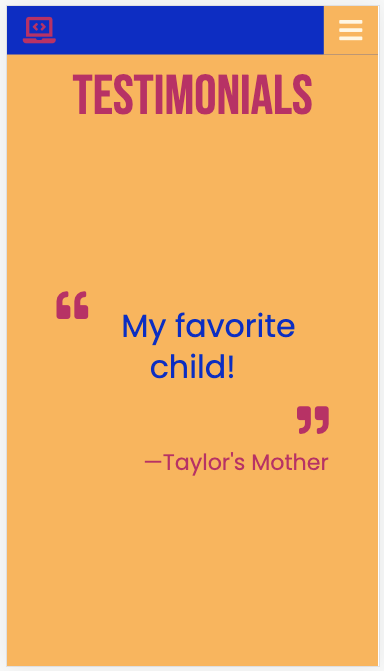
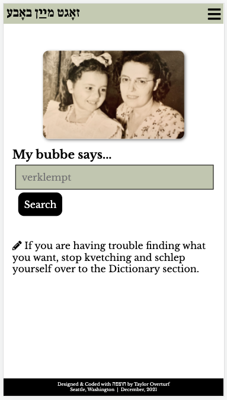

# Mobile-First Design

This file contains screenshots of my mobile-first mentality when it comes to my personal coding projects. 

All images show my coding projects displayed on an iPhone SE's dimensions which is 5.45 by 2.65 inches. 

### StackOverturf
*StackOverturf* is my developer portfolio site. 

Landing Page  

Testimonials 

### Hex Anderson
*Hex Anderson* is a hex code palette generator site.

Landing Page 

Moonrise Kingdom Color Palette 

Moonrise Kingdom Color Palette Testing Function 

### Medpramin
*Medpramin* is a prescription drug name generator and game application.

Landing Page 

About 

Comparison Game, Nav Bar Open 

### My Bubbe Says
*My Bubbe Says* is a site for the preservation and continuation of the Yiddish language, as taught by Jewish American bubbes.

Landing Page 

Yiddish Dictionary  

Search Function  

About 

